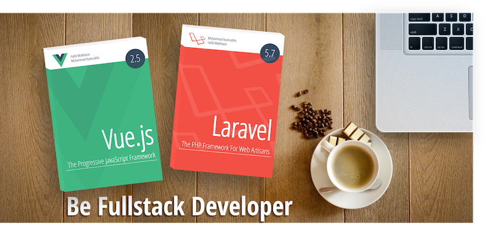

# Larashop-api

Demo [https://api.vueshop.id](https://api.vueshop.id)

## Overview
Larashop API adalah restful web service untuk aplikasi toko online berbasis mobile web [https://vueshop.id](https://vueshop.id) yang dibangun dengan menggunakan framework PHP [Laravel](https://laravel.com).

Larashop API merupakan bagian dari projek studi kasus pada buku ["Be Fullstack Developer"](http://buku-laravel-vue.com)

Link studi kasus lain pada buku ini:
- [Larashop](https://github.com/laravel-vue-book/larashop)
- [Vueshop](https://github.com/laravel-vue-book/vueshop)

## Getting Started

1. Pastikan anda sudah menginstalasi web server (Apache / Nginx), PHP, dan MySQL
2. Clone repository ini
3. Buat database
4. Buat file .env via terminal `cp env.example .env`
5. Update konfigurasi database pada file `.env`
6. Migrate database via terminal `php artisan migrate:refresh --seed`
7. Jalankan `php artisan serve`

## Authors

Penulis buku ini adalah [Hafid Mukhlasin](http://hafidmukhlasin.com) dan [Muhammad Azamuddin](http://arrowfunxtion.com)